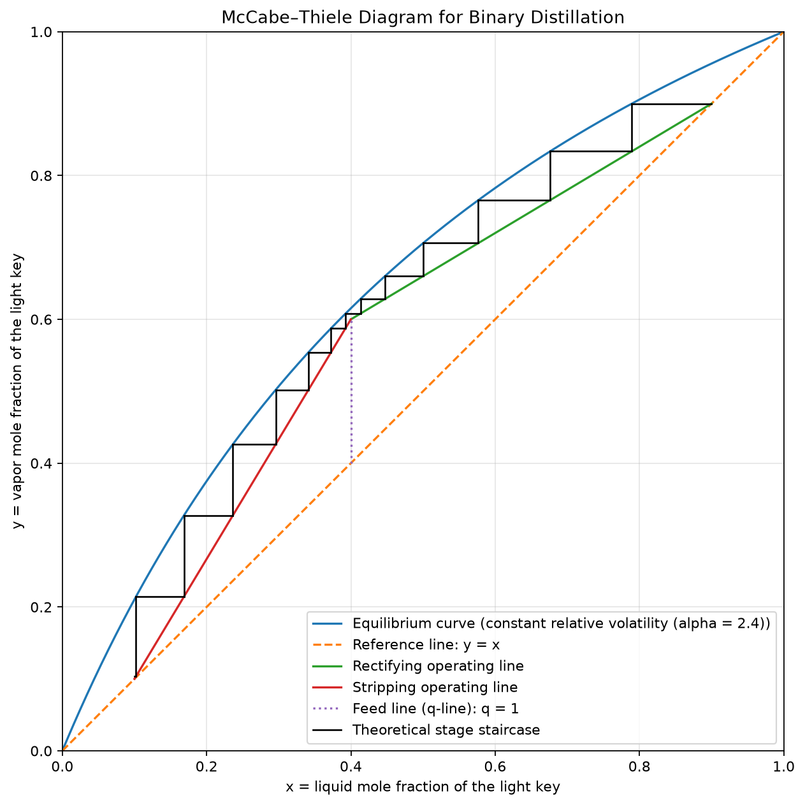

# Binary-Distillation-Column-Simulator

A small Python program that uses the McCabe–Thiele method to estimate theoretical stages for a binary distillation separation.

## VLE input options

- Constant relative volatility, using the entered `alpha` value.
- Direct VLE data from a CSV file. Choose option `2` at the prompt and provide a CSV path.

CSV files must have header columns named `x` and `y`, with one equilibrium point per row. Values must be finite mole fractions between 0 and 1, strictly increasing in both columns, and include the endpoints `(0, 0)` and `(1, 1)`.

The program also detects interior intersections with `y = x` (azeotropes). An intersection listed in the CSV is reported exactly; one between points is estimated by linear interpolation. For a feed below an azeotrope in the light-key region, `xD` must remain below the azeotrope; product specifications on the other side are rejected and re-prompted. `xB` is likewise kept above any lower azeotropic boundary.

```csv
x,y
0.0,0.0
0.2,0.43
0.5,0.70
0.8,0.91
1.0,1.0
```

See `example_vle_data.csv` for a regular VLE curve and `example_azeotropic_vle_data.csv` for a curve with an azeotrope at `x = y = 0.5`.
- Constant Molar Overflow (CMO)
- Negligible heat effects
- Isobaric operation

## Assumptions
- Constant Molar Overflow (CMO)
- Negligible heat effects
- Isobaric operation

## Inputs
- Relative volatility or VLE data
- Feed composition
- Distillate purity
- Bottoms purity
- Feed thermal condition (`q`)
- Reflux ratio

The reported value is rounded up to a whole number of theoretical stages when the final reboiler stage is partial. A total condenser is not counted as an equilibrium stage.

## Run
```bash
pip install -r requirements.txt
python simulator.py
```

## Reproducible example

The following inputs use the constant-relative-volatility model and reproduce the
plot below:

```text
alpha = 2.4
zF    = 0.40
xD    = 0.90
xB    = 0.10
q     = 1.0
R     = 1.5
```

For these values, the calculated minimum reflux ratio is `Rmin = 1.3214`, so
`R = 1.5` is valid. The simulator estimates **14 theoretical stages**. The
total condenser is not counted, and a partially traversed final reboiler is
counted as one whole stage.



The example can be reproduced interactively with `python simulator.py` by
selecting relative volatility and entering the values above.

## Model assumptions and limitations

The simulator applies the McCabe–Thiele method under these assumptions:

- Binary mixture with a designated light key and heavy key.
- Constant molar overflow (constant liquid and vapor molar flow rates in each
  column section).
- Isobaric operation with negligible heat losses and heat effects.
- Each theoretical stage reaches vapor–liquid equilibrium.
- A total condenser is used and is not counted as an equilibrium stage; the
  reboiler is included in the reported stage count.
- For the constant-volatility option, relative volatility is constant across
  the column. CSV VLE data are treated as piecewise-linear equilibrium data.

Results are estimates rather than a detailed process design. The model does
not account for tray or packing efficiency, pressure drop, hydraulic limits,
entrainment, weeping, flooding, heat-integration requirements, condenser or
reboiler sizing, energy balances, or multicomponent effects. Real mixtures
with strongly temperature-dependent volatility or significant non-ideal
behavior should use measured or thermodynamic VLE data and independently
validate the predicted separation. Azeotropes cannot be crossed by ordinary
binary distillation in this calculation.

## Tests

Install the dependencies and run the automated test suite with:

```bash
python -m pytest
```
